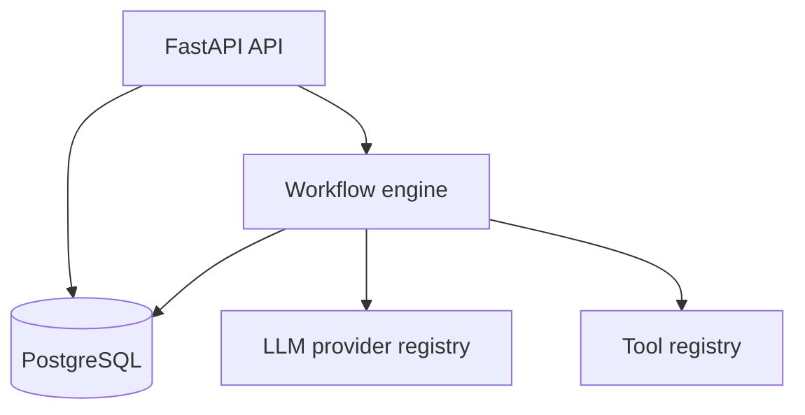

# Agent Runtime

Agent Runtime is a small, production-minded workflow engine for executing sequential LLM and tool steps with durable state, retries, timeouts, idempotency, and step-level observability.

It deliberately implements the orchestration core without an agent framework. The result is compact enough to understand in an interview, while still addressing the failure modes that appear when AI workflows leave a notebook and enter production.

## What it demonstrates

- FastAPI API and typed Pydantic contracts
- PostgreSQL persistence with SQLAlchemy and Alembic
- Pluggable LLM providers and tool registry
- Deterministic local execution without API credentials
- Exponential retry backoff and per-step timeouts
- Idempotent run creation under concurrent requests
- Latency, token, cost, input, output, and error recording per step
- JSON structured logging, Docker Compose, tests, type checking, linting, and CI

## Architecture



A run executes synchronously in v0.1. Each step resolves references from the run input or earlier step output, executes within a timeout, persists its attempt and telemetry, then makes its output available to later steps.

See [architecture](docs/architecture.md) and [production considerations](docs/production-considerations.md) for the detailed design and trade-offs.

## Quick start with Docker

Requirements: Docker with Compose.

```bash
docker compose up --build
```

Open the API documentation at <http://localhost:8000/docs>. In another terminal, execute the end-to-end demo:

```bash
make demo
```

The demo creates a two-step workflow (fake LLM, then uppercase tool), runs it with an idempotency key, and prints the recorded run.

## Local development

Requirements: Python 3.12 and [uv](https://docs.astral.sh/uv/).

```bash
cp .env.example .env
uv sync --extra dev
docker compose up -d db
uv run alembic upgrade head
uv run uvicorn app.main:app --reload
```

For dependency-free experimentation, omit `.env`; development defaults to a local SQLite database and creates tables automatically.

## API example

Create a workflow:

```bash
curl -X POST http://localhost:8000/v1/workflows \
  -H 'Content-Type: application/json' \
  -d '{
    "name": "Reliable writer",
    "definition": {"steps": [
      {"key": "draft", "type": "llm", "provider": "fake", "input": "Explain ${input.topic}"},
      {"key": "publish", "type": "tool", "tool": "uppercase", "input": "${steps.draft.output}"}
    ]}
  }'
```

Run it, replacing `<workflow-id>`:

```bash
curl -X POST http://localhost:8000/v1/workflows/<workflow-id>/runs \
  -H 'Content-Type: application/json' \
  -H 'Idempotency-Key: article-001' \
  -d '{"inputs":{"topic":"reliable AI systems"}}'
```

References support `${input.<key>}` and `${steps.<step-key>.output}`. A reference occupying the entire value preserves JSON types; references embedded in text are stringified.

## Quality checks

```bash
make check
```

This runs Ruff lint/format checks, strict mypy, and the pytest suite with coverage.

## Built-in extensions

LLM providers implement the `LLMProvider` protocol and are registered in `ProviderRegistry`. Tools are async callables registered in `ToolRegistry`. v0.1 ships `fake`, `echo`, `uppercase`, and `extract_field` implementations.

## API endpoints

| Method | Path | Purpose |
|---|---|---|
| `GET` | `/v1/health` | Liveness check |
| `POST` | `/v1/workflows` | Validate and persist a workflow |
| `GET` | `/v1/workflows` | List workflows |
| `GET` | `/v1/workflows/{id}` | Inspect a workflow |
| `POST` | `/v1/workflows/{id}/runs` | Create and synchronously execute a run |
| `GET` | `/v1/runs/{id}` | Inspect a run and all step telemetry |

## Roadmap

- v0.2: queue-backed workers, leases, heartbeats, and recovery of interrupted runs
- v0.3: OpenAI/Anthropic adapters, encrypted credentials, and provider fallback
- v0.4: DAG execution, parallel branches, and human approval steps
- v0.5: OpenTelemetry traces, Prometheus metrics, evaluation datasets, and budgets

## License

MIT
