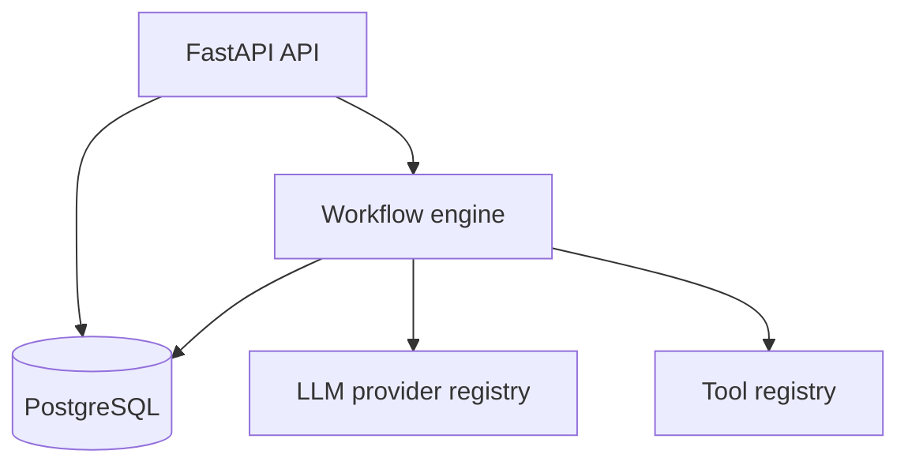

# Agent Runtime

Agent Runtime is a small, production-minded workflow engine for executing sequential LLM and tool steps with durable state, retries, timeouts, idempotency, and step-level observability.

It deliberately implements the orchestration core without an agent framework. The result is compact enough to understand in an interview, while still addressing the failure modes that appear when AI workflows leave a notebook and enter production.

## What it demonstrates

- FastAPI API and typed Pydantic contracts
- PostgreSQL persistence with SQLAlchemy and Alembic
- Pluggable LLM providers and tool registry
- Optional OpenAI and Anthropic providers configured from the environment
- Ordered LLM provider fallback with selected-provider telemetry
- Deterministic local execution without API credentials
- Exponential retry backoff and per-step timeouts
- Idempotent run creation under concurrent requests
- Optional deferred execution through database workers with renewable leases
- Conservative recovery of expired worker leases without automatic side-effect replay
- Latency, token, cost, input, output, and error recording per step
- Prometheus HTTP request rate, error, latency, and in-progress metrics
- JSON structured logging, Docker Compose, tests, type checking, linting, and CI

## Architecture


```mermaid
flowchart TD
    API["FastAPI API"] --> DB[(PostgreSQL)]
    API --> Engine["Workflow engine"]
    Engine --> Provider["LLM provider registry"]
    Engine --> Tools["Tool registry"]
    Engine --> DB
```

A run executes synchronously in v0.1. Each step resolves references from the run input or earlier step output, executes within a timeout, persists its attempt and telemetry, then makes its output available to later steps.

See [architecture](docs/architecture.md) and [production considerations](docs/production-considerations.md) for the detailed design and trade-offs.

## Quick start with Docker

Requirements: Docker with Compose.

```bash
docker compose up --build
```

Open the API documentation at <http://localhost:8000/docs>. In another terminal, execute the end-to-end demo:

```bash
make demo
```

The demo creates a two-step workflow (fake LLM, then uppercase tool), runs it with an idempotency key, and prints the recorded run.

Prometheus metrics are available at <http://localhost:8000/v1/metrics>. They use HTTP method,
matched route template, and status code labels; concrete resource IDs are never used as labels.

## Local development

Requirements: Python 3.12 and [uv](https://docs.astral.sh/uv/).

```bash
cp .env.example .env
uv sync --extra dev
docker compose up -d db
uv run alembic upgrade head
uv run uvicorn app.main:app --reload
```

For dependency-free experimentation, omit `.env`; development defaults to a local SQLite database and creates tables automatically.

## API example

Create a workflow:

```bash
curl -X POST http://localhost:8000/v1/workflows \
  -H 'Content-Type: application/json' \
  -d '{
    "name": "Reliable writer",
    "definition": {"steps": [
      {"key": "draft", "type": "llm", "provider": "fake", "input": "Explain ${input.topic}"},
      {"key": "publish", "type": "tool", "tool": "uppercase", "input": "${steps.draft.output}"}
    ]}
  }'
```

Run it, replacing `<workflow-id>`:

```bash
curl -X POST http://localhost:8000/v1/workflows/<workflow-id>/runs \
  -H 'Content-Type: application/json' \
  -H 'Idempotency-Key: article-001' \
  -d '{"inputs":{"topic":"reliable AI systems"}}'
```

To enqueue the run instead of executing it in the API process, add
`Prefer: respond-async` and start a worker in another terminal:

```bash
make worker
```

The API returns `202 Accepted` with a pending run. Workers claim pending runs in creation order
using a row lock, so multiple worker processes can poll without executing the same run. Each claim
records a worker ID and lease deadline; the worker extends the lease with periodic heartbeats and
releases it after the run finishes. Before claiming new work, workers mark expired runs and their
incomplete steps as failed. They deliberately do not replay interrupted steps automatically.

References support `${input.<key>}` and `${steps.<step-key>.output}`. A reference occupying the entire value preserves JSON types; references embedded in text are stringified.

## Quality checks

```bash
make check
```

This runs Ruff lint/format checks, strict mypy, and the pytest suite with coverage.

## Built-in extensions

LLM providers implement the `LLMProvider` protocol and are registered in `ProviderRegistry`. An
LLM step can define up to five ordered `fallback_providers`; the first successful provider is stored
on the step run. Tools are async callables registered in `ToolRegistry`. The runtime ships `fake`,
`echo`, `uppercase`, and `extract_field` implementations. Set `OPENAI_API_KEY` to register the
`openai` provider; `OPENAI_MODEL` defaults to `gpt-5-mini`. The key is read from the process
environment and is never stored in a workflow or run. Set `ANTHROPIC_API_KEY` to register the
`anthropic` provider; `ANTHROPIC_MODEL` defaults to `claude-sonnet-5` and
`ANTHROPIC_MAX_TOKENS` defaults to `4096`.

## API endpoints

| Method | Path | Purpose |
|---|---|---|
| `GET` | `/v1/health` | Liveness check |
| `GET` | `/v1/metrics` | Prometheus HTTP RED metrics |
| `POST` | `/v1/workflows` | Validate and persist a workflow |
| `GET` | `/v1/workflows` | List workflows |
| `GET` | `/v1/workflows/{id}` | Inspect a workflow |
| `POST` | `/v1/workflows/{id}/runs` | Execute a run, or enqueue it with `Prefer: respond-async` |
| `GET` | `/v1/runs/{id}` | Inspect a run and all step telemetry |

## Roadmap

- v0.2: database-backed workers, leases, heartbeats, and terminal expired-run recovery; resumable recovery next
- v0.3: provider fallback plus OpenAI and Anthropic adapters delivered; encrypted credentials next
- v0.4: DAG execution, parallel branches, and human approval steps
- v0.5: Prometheus HTTP metrics delivered; OpenTelemetry traces, evaluation datasets, and budgets next

## License

MIT
