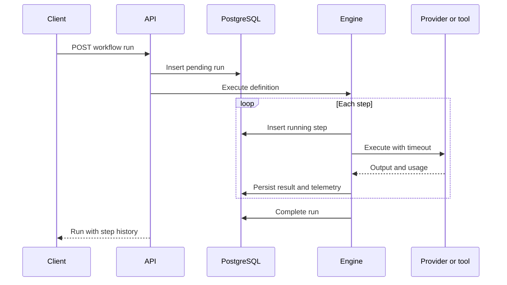
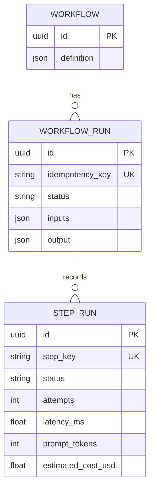

# Architecture

## Goals

Agent Runtime v0.1 provides the smallest end-to-end slice of a durable AI workflow system: validated workflow definitions, sequential execution, persistent run history, failure policies, and telemetry. It favors explicit interfaces and inspectable code over a broad feature set.

## Execution lifecycle

1. The API validates a workflow definition with Pydantic before persisting it.
2. A client creates a run with inputs and an optional `Idempotency-Key` header.
3. A unique database constraint guarantees one run per workflow and idempotency key, including races.
4. The engine resolves input references immediately before each step.
5. Each attempt runs under `asyncio.wait_for`; retry delay grows exponentially.
6. State and telemetry are committed around execution boundaries so a failure remains inspectable.
7. The last step output becomes the workflow output.

## Components

### API

`app/api.py` owns HTTP behavior only: validation, resource lookup, idempotent creation, and response serialization. It does not know provider-specific details.

### Domain and persistence

`Workflow` stores the immutable definition used for new runs. `WorkflowRun` stores lifecycle state and final output. `StepRun` is both the audit trail and the unit of observability, including attempt count, latency, tokens, cost, and error.

### Execution engine

`WorkflowEngine` is an application service rather than a web concern. It accepts a database session, run, and validated definition, so it can later be invoked by a queue worker without changing the workflow semantics.

### Providers and tools

The provider boundary returns a normalized `LLMResult`, preventing provider response shapes from leaking into the engine. The tool boundary is intentionally narrow: an async callable from JSON-compatible input to output. Registries use explicit allowlists, so workflow definitions cannot import arbitrary Python code.

LLM steps may declare an ordered fallback chain. The engine tries the primary provider followed by
each fallback within the existing step timeout and retry boundary. Only the successful provider is
persisted on `StepRun`; failed provider attempts emit structured logs without provider exception
messages, reducing the chance of logging sensitive response data.

## Reference model

Steps can refer to `${input.key}` or `${steps.step-key.output}`. References are resolved recursively inside dictionaries and lists. Full-value references preserve their JSON type; interpolation into a larger string produces text.

This intentionally avoids an embedded expression language in v0.1. Expression engines add attack surface, nondeterminism, and a second programming model.

## Failure semantics

- Provider and tool calls have bounded timeouts.
- A retry policy controls maximum attempts and exponential backoff.
- A failed step fails the run and prevents later steps from executing.
- Completed prior steps are retained for diagnosis.
- Error strings are recorded; production adapters must redact secrets before raising.

## Data model

## Execution modes

Execution remains synchronous by default, preserving the simple local demo. Clients can send
`Prefer: respond-async` to persist a pending run and receive `202 Accepted`; an `agent-worker`
process claims the oldest pending run with `FOR UPDATE SKIP LOCKED` and invokes the same engine.
The database is the initial queue so run creation and claim state share one transaction boundary.
Each claim stores a worker ID, heartbeat timestamp, and lease deadline. A separate database session
renews the lease during execution so provider calls do not block heartbeats.

Before claiming new work, a worker locks expired runs in bounded batches and marks each run plus
its incomplete steps as failed. Clearing ownership fences out the previous worker. Before persisting
a step result, every leased worker locks the run row and verifies that its ownership and deadline
are still valid, preventing a late result from overwriting recovery. The runtime does not replay the
interrupted step: resumable recovery is separate because external side effects cannot be repeated
blindly.
